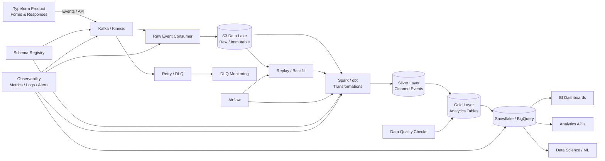

# Typeform Data Pipeline

## Overview

This project sketches a production-oriented ETL/data platform for analytics data generated by a form platform such as Typeform.

The design focuses on:

* Reliable event ingestion
* Immutable raw storage
* Batch/stream transformations
* Analytics-ready data models
* Idempotency and deduplication
* Out-of-order event handling
* Replay and backfills
* Data quality and observability
* Security and privacy

## Architecture



## Data Flow

1. Product services emit events such as form views, starts, submissions, question responses, completion/drop-off events, and metadata changes.
2. Events are published to Kafka/Kinesis.
3. Consumers validate the event envelope and write the original payload to an immutable S3 raw layer.
4. Spark/dbt transforms raw events into cleaned Silver datasets.
5. Gold datasets aggregate business metrics such as views, starts, submissions, completion rate, response time, and drop-off by form, workspace, and time.
6. Snowflake/BigQuery serves BI, APIs, analytics, and ML consumers.

## Storage Layers

### Bronze / Raw

* Immutable event payloads
* Stored in S3, preferably Parquet after landing
* Partitioned by event date/hour
* Retains the original event for replay and audit

### Silver

Cleaned and normalized events with:

* Standardized timestamps
* Validated schemas
* Deduplicated event IDs
* Normalized form/workspace/question identifiers
* Data-quality flags

### Gold

Analytics-ready models, for example:

* `form_daily_metrics`
* `form_completion_funnel`
* `question_response_metrics`
* `workspace_usage_metrics`

## Event Contract

A representative event envelope:

```json
{
  "event_id": "uuid",
  "event_type": "form_submitted",
  "event_time": "2026-10-02T10:15:00Z",
  "ingestion_time": "2026-10-02T10:15:02Z",
  "form_id": "form_123",
  "workspace_id": "workspace_456",
  "schema_version": 3,
  "payload": {}
}
```

## Deduplication and Idempotency

The pipeline assumes at-least-once delivery.

Each event has a stable `event_id`. Consumers maintain an idempotency/deduplication strategy so retries do not create duplicate analytical records.

For warehouse writes, merge/upsert semantics can be used where appropriate.

Exactly-once end-to-end semantics are avoided as a blanket assumption because they add operational complexity. Instead, the design makes individual stages replayable and writes idempotent.

## Out-of-Order Events

Events use both:

* `event_time`: when the user action occurred
* `ingestion_time`: when the platform received the event

Analytics windows are based primarily on event time. Streaming jobs use watermarks and a bounded lateness window to accommodate delayed events.

For events arriving after the normal lateness window:

1. Store them in the raw layer.
2. Process them through a correction/reconciliation path.
3. Recompute affected aggregates if required.

## Failure Handling

| Failure                    | Handling                             |
| -------------------------- | ------------------------------------ |
| Temporary consumer failure | Retry with exponential backoff       |
| Poison event               | Send to DLQ                          |
| Kafka/Kinesis outage       | Buffer/retry and preserve offsets    |
| Transformation failure     | Airflow retry + failed task alert    |
| Warehouse failure          | Retry writes; preserve upstream data |
| Schema mismatch            | Reject/quarantine and alert          |
| Duplicate event            | Idempotency key / event_id           |
| Late event                 | Watermark + reconciliation           |
| Corrupt data               | Quarantine without dropping raw data |

A key principle is **no silent data loss**.

## Replay and Backfills

The immutable S3 layer acts as the recovery source.

A failed date/hour/partition can be replayed without requesting events from the product again.

Airflow can orchestrate parameterized backfills such as:

```text
backfill_date=2026-10-01
form_id=form_123
```

The same transformation code should support both normal processing and historical reprocessing.

## Schema Evolution

A schema registry maintains versioned event contracts.

Compatible changes can be rolled forward. Breaking changes require a new schema version and controlled migration.

Consumers should tolerate unknown optional fields where practical.

## Data Quality

Checks include:

* Event uniqueness
* Required-field validation
* Referential integrity
* Null-rate thresholds
* Valid event types
* Timestamp sanity
* Expected volume / freshness
* Aggregate reconciliation

Examples:

```text
event_id uniqueness = 100%
freshness lag < agreed SLA
submission metrics reconcile with source events
```

Failed checks should block promotion of affected Gold data when the error could materially corrupt analytics.

## Orchestration

Airflow coordinates:

* Scheduled transformations
* Data quality checks
* Backfills
* Dependency management
* Alerting and retries

For high-volume real-time transformations, streaming jobs remain continuously running while Airflow handles scheduled and recovery workflows.

## Scalability

The design scales horizontally through:

* Kafka/Kinesis partitions
* Distributed Spark processing
* S3 object storage
* Warehouse compute scaling
* Partitioned datasets
* Incremental transformations

Partitioning should follow access patterns. Event datasets can be partitioned by event date, with form/workspace identifiers used for clustering where supported.

## Observability

Track:

* Event ingestion rate
* Consumer lag
* Processing latency
* Failed records
* DLQ volume
* Data freshness
* Schema validation failures
* Transformation duration
* Warehouse load failures
* Data-quality failures

Alerts should be tied to user/business impact rather than every transient error.

## Security and Privacy

Because form responses can contain sensitive user-provided information:

* Encrypt data at rest and in transit
* Apply least-privilege IAM/RBAC
* Minimize or tokenize sensitive fields
* Separate access to raw and curated data
* Apply retention/deletion policies
* Audit data access
* Avoid exposing unnecessary response content to analytics consumers

## Technology Choices

| Component       | Choice                  | Rationale                                  |
| --------------- | ----------------------- | ------------------------------------------ |
| Event ingestion | Kafka / Kinesis         | Durable, scalable event ingestion          |
| Raw storage     | S3                      | Cheap, durable, replayable source of truth |
| Processing      | Spark                   | Distributed batch/stream processing        |
| Transformations | dbt                     | Maintainable analytical transformations    |
| Orchestration   | Airflow                 | Scheduling, retries, backfills             |
| Warehouse       | Snowflake / BigQuery    | Analytics and SQL serving                  |
| Schema          | Schema Registry         | Contract/version management                |
| Monitoring      | Metrics + logs + alerts | Operational visibility                     |

## Key Trade-offs

### Kafka/Kinesis vs Direct S3

An event broker decouples producers from consumers and supports multiple downstream consumers, at the cost of operational complexity.

### Spark vs Warehouse-Native SQL

Spark is useful for large-scale transformation and richer processing. Warehouse-native SQL is simpler for straightforward analytical transformations.

### Streaming vs Batch

Streaming provides lower latency but increases operational complexity. A hybrid model provides real-time paths where needed while retaining batch reconciliation and backfills.

## Reliability Guarantees

The target design provides:

* At-least-once ingestion
* Idempotent downstream processing
* Replayable raw data
* Recoverable transformations
* Explicit DLQ handling
* Schema validation
* Data-quality gates
* Monitoring and alerting

The goal is not merely to process data quickly, but to make the pipeline **observable, recoverable, and trustworthy for analytics**.

## Future Improvements

Potential extensions:

* Real-time feature generation for ML
* CDC for configuration metadata
* Data catalog and lineage
* Automated anomaly detection
* Lakehouse table formats such as Iceberg
* Cost-aware workload scheduling
* Privacy-aware deletion propagation

## Summary

This architecture separates ingestion, storage, transformation, and serving concerns while keeping the complete pipeline replayable.

The most important reliability decisions are:

1. **Immutable raw storage** for recovery and backfills.
2. **At-least-once ingestion + idempotent processing** rather than assuming perfect exactly-once delivery.
3. **Event-time processing with bounded lateness** for out-of-order events.
4. **DLQs and quarantine paths** so bad records do not silently disappear.
5. **Data-quality gates and observability** before analytics data reaches consumers.
6. **Security and privacy controls** around potentially sensitive form responses.

This gives Typeform a scalable analytics foundation that can support BI, product analytics, APIs, and downstream ML use cases.
